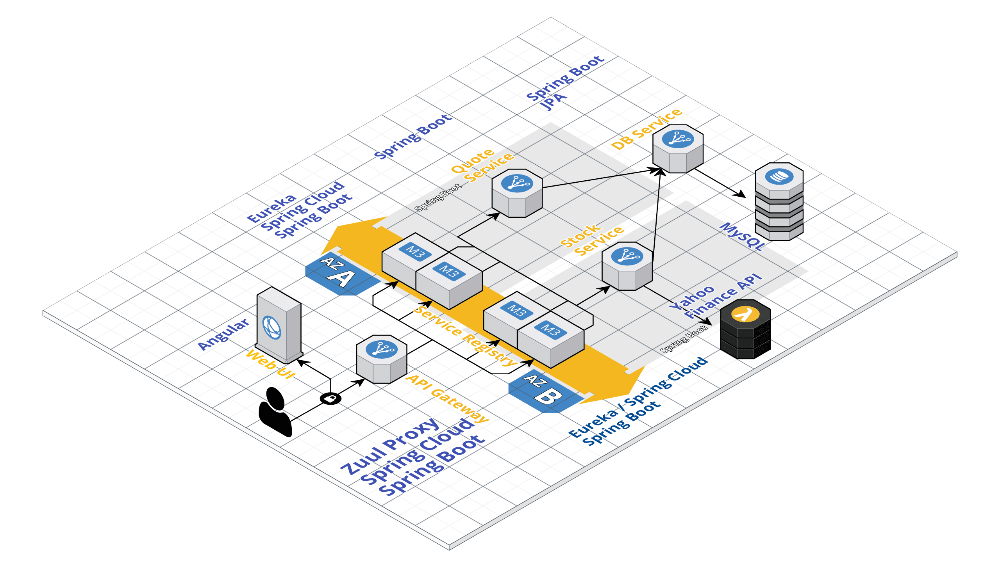
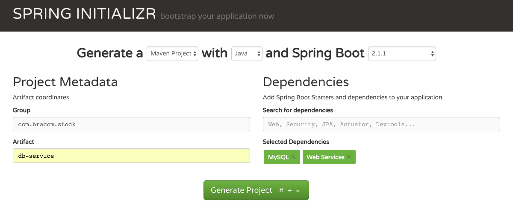

# spring-boot-microservices
Architechture

## Table of Contents
* db-service     For interactive with MySQL DB
* stock-service  For pulling Stock Prices using the YahooFinance API
* eureka-service Service Registry for registering all microservices + Proxy/API Gateway for all microservices (using Zuul)
* ui             Angular JS UI Code for Adding new quotes and retrieving stock price

## Services and Tooling

https://start.spring.io/
 

